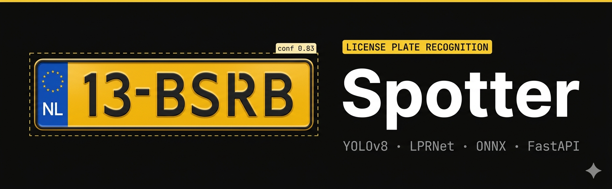

# Spotter



> Real-time license plate detection and recognition — built for Macondo.

**[Live Demo →](https://xtimate.github.io/torch-licenseplate/)** · **[Documentation →](https://github.com/Xtimate/torch-licenseplate/wiki)**

---

## What is it?

Spotter is an end-to-end license plate recognition system built from scratch. It combines a YOLOv8 detector with a custom-trained LPRNet recognizer, both exported to ONNX and served via a FastAPI backend. A SvelteKit frontend lets you test it in real time — upload an image, scan a video, or point your webcam at a plate.

The whole thing runs on a $6/month DigitalOcean droplet with no cloud vision APIs. Detection, recognition, and confidence calibration are all self-contained.

---

## Why I built it

I wanted to understand how OCR actually works at a low level not just call an API, but build the full pipeline from synthetic data generation through model training, ONNX export, and production deployment. License plates are a good target because the problem is constrained enough to be tractable but hard enough that naive approaches fail.

---

## How it works

```
Image / video frame
    └─ YOLOv8 detector → bounding boxes
            └─ crop each detection
                    └─ LPRNet (CTC) → character sequence
                            └─ temperature-scaled confidence
                                    └─ format validation (NL/DE/FR)
                                            └─ result
```

**Detection** — YOLOv8n fine-tuned on real license plate images, exported to ONNX. Runs in ~160ms on CPU.

**Recognition** — Custom CNN with a CTC head, trained on a mixed dataset of synthetic plates and real EU crops. Input is 188×48px, output is a character sequence with per-character confidence scores.

**Calibration** — CTC models are overconfident by default. Temperature scaling is applied post-training to make confidence scores actually reflect accuracy (found via Expected Calibration Error minimization on held-out real plates).

**Frontend** — SvelteKit single-page app. Draws bounding boxes on the image client-side via Canvas, shows per-character confidence bars, and maintains a recognition history with watchlist support.

---

## Stack

| Layer | Tech |
|-------|------|
| Detection | YOLOv8 + ONNX Runtime |
| Recognition | Custom LPRNet + CTC + ONNX Runtime |
| Backend | FastAPI, uvicorn, SQLite |
| Frontend | SvelteKit, Tailwind |
| Deployment | DigitalOcean, Caddy, GitHub Pages |
| Training | PyTorch, Albumentations |

---

## Quick start

**Backend**
```bash
git clone https://github.com/Xtimate/torch-licenseplate.git
cd torch-licenseplate
python -m venv venv && source venv/bin/activate
pip install -r requirements.txt
cp .env.example .env  # set CONF_THRESHOLD and TEMPERATURE
PYTHONPATH=src uvicorn api.main:app --reload
```

**Frontend**
```bash
cd spotter-ui
echo "VITE_API_BASE=http://localhost:8000" > .env.development
npm install && npm run dev
```

See the [Deployment wiki page](https://github.com/Xtimate/torch-licenseplate/wiki/Deployment) for full server setup, and the [Training wiki page](https://github.com/Xtimate/torch-licenseplate/wiki/Training) for retraining the models.

---

## Project structure

```
src/
  generator.py               # synthetic plate generation
  generate_mixed_dataset.py  # real + synthetic dataset pipeline
  dataset.py                 # charset, encode/decode
  recognizer.py              # LPRNet, CTC decode, confidence calibration
  detector.py                # YOLO ONNX inference
  pipeline.py                # detect + recognize pipeline
  train_recognizer.py        # training script
  calibrate.py               # temperature calibration (ECE)
  export_onnx.py             # export to ONNX
api/
  main.py                    # FastAPI app, lifespan, cache
  routers/                   # detect, recognize, pipeline, video, webcam, history, watchlist
  database.py                # SQLite
spotter-ui/                  # SvelteKit frontend
onnx/                        # exported models
```

---

Built for **Macondo** — a Hackclub project.
